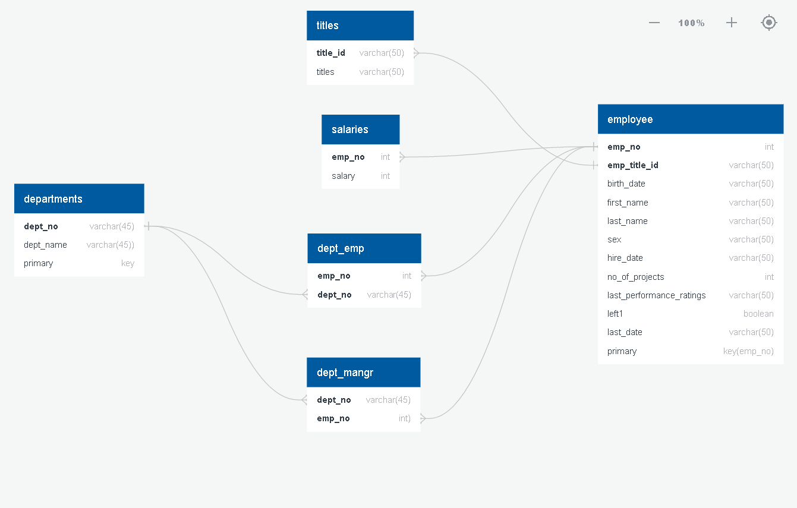

# Employee-Capstone-Project
# CAPSTONE PROJECT ON EMPLOYEES DATA
## Summary:
You have been hired as a new data engineer at Analytixlabs. Your first major task is a data engineering project on 
employees of the one of the big corporation from the 1980s and 1995s. All that remain of the database of employees 
from that period are six CSV files. In this project, you will design the tables to hold data in the CSVs, import the CSVs 
into a SQL database, import to HDFS/Hive, and perform analysis using Hive/Impala/Spark/SparkML using the data and 
create pipelines.

## DATA MODELING
After inspecting the CSVs, I created an ERD using Quick Database Diagrams to better visualize the dataset.

## DATA ENGINEERING
 Working with CSV's files from Employees dataset we'll do
* Create database & tables in MySQL server as per the above ER Diagram.
* Create Sqoop job to transfer the data from MySQL to HDFS (Data required to store in Parque/Avro/Json format).
* Create database in Hive as per the above ER Diagram and load the data into Hive tables.
## DATA ANALYSIS

* Work on Exploratory data analysis as per the analysis requirement using Impala and Spark SQL.

## MACHINE LEARNING MODEL(LINEAR AND LOGISTIC REGRESSION) AND PIPELINE

* Builded ML Model as per the requirement.
* Created entire data pipeline and ML pipe line.

###### NOTE
* This Project is done on NUVEPRO Cloud Lab by accessing WEBSHELL, HUE, JUPYTERNOTEBOOK.
